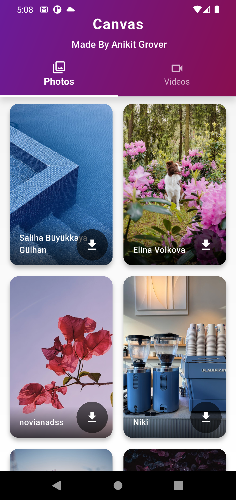
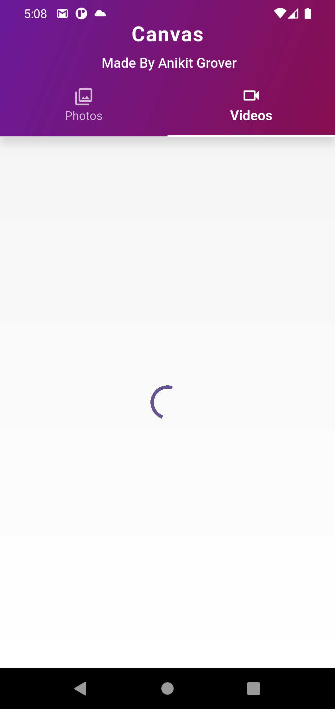
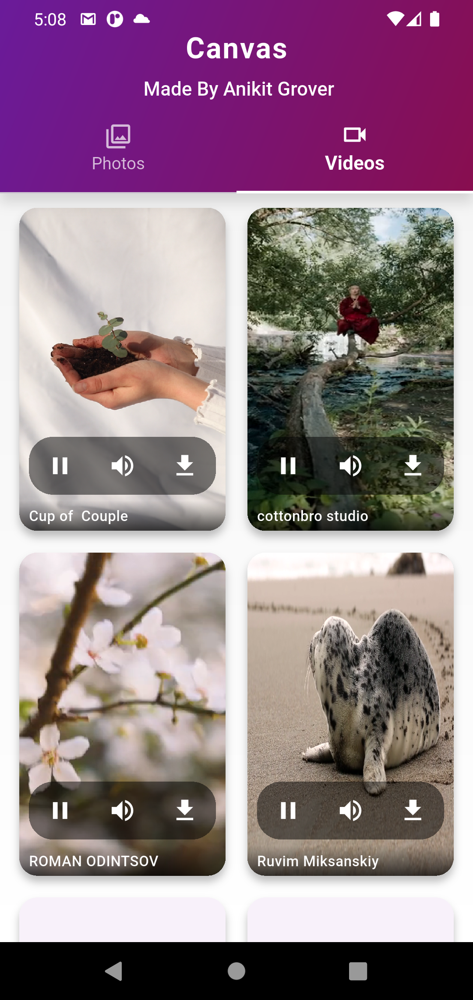

# Canvas: Dynamic Wallpapers & Live Videos 🌈

Welcome to **Canvas**, your ultimate destination for stunning wallpapers and captivating live videos\! Built with **Flutter**, this cross-platform mobile application delivers a seamless experience for discovering and personalizing your device's background. Canvas leverages the extensive content library of the **Pexels API** to provide an endless stream of high-quality visuals, complete with powerful search capabilities for both photos and videos.

This project showcases efficient API integration, responsive UI design, and robust data handling to create a fluid and engaging user experience.

-----

## 🛠️ Technology Stack

  * **Flutter**: For building a beautiful, natively compiled, multi-platform UI (Android & iOS).
  * **Pexels API**: The primary content source for high-resolution photos and videos.
  * **`http` package**: For making efficient network requests to the Pexels API.
  * **`cached_network_image`**: For intelligent image caching, ensuring smooth scrolling and optimal performance.

-----

## 📸 Screenshots

Here's a glimpse of the Canvas app in action:

## 📺 Demo Video

See Canvas in action\! Watch a detailed walkthrough of the app's features and user flow on YouTube:

[**Watch the Canvas App Demo on YouTube**](https://www.youtube.com/playlist?list=PLj518-AUxFs8zE5ualJrqFxqsFo7fcu3R)

## ✨ Application Flow & Key Features

Canvas is designed to offer a delightful and straightforward content discovery journey.

### 1\. **Explore & Discover**

  * **🏡 Dynamic Homepage**: A vibrant landing page featuring a curated selection of photos and popular videos, ensuring fresh content upon every visit.
  * **📸 Dedicated Photo Tab**: Browse through an extensive collection of high-resolution images, perfect for static wallpapers.
  * **🎥 Dedicated Video Tab**: Dive into captivating short videos, ideal for dynamic live backgrounds.
  * **🔍 Intuitive Search Functionality**: Easily find specific photos or videos using keywords, providing instant and relevant results across both content types.

### 2\. **Immersive Viewing Experience**

  * **🖼️ Full-Screen Image Viewer**: View photos in their full glory with pan and zoom capabilities.
  * **▶️ Integrated Video Player**: Seamlessly play and preview live videos directly within the app.

### 3\. **Personalization & Interaction**

  * **⬇️ Download Options**: Download your favorite photos and videos directly to your device.
  * **👍 High-Quality Content**: All media is sourced from Pexels, ensuring professional-grade quality.

-----
